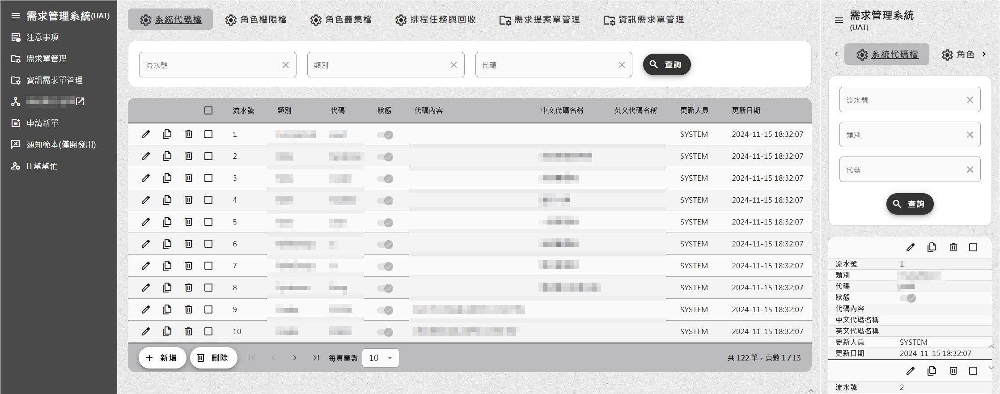
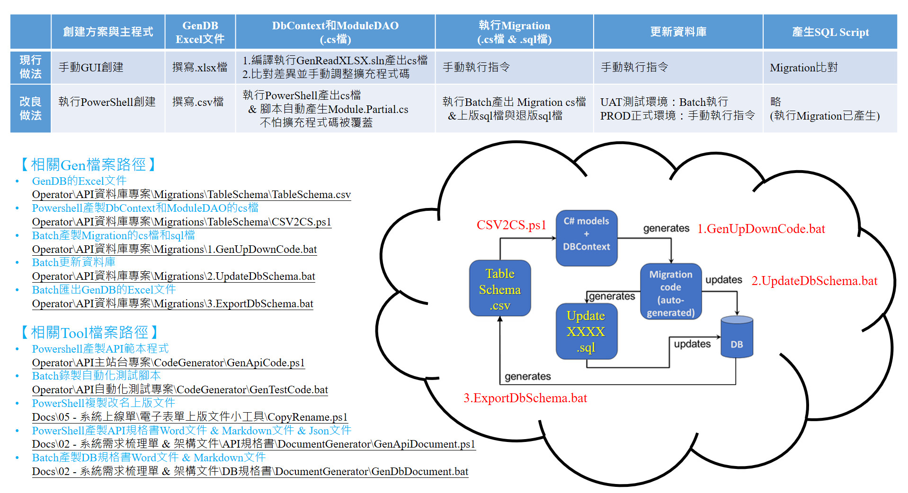
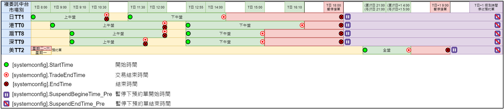

# 許竹君 Resume

[TOC]

##  簡介

<table>
  <tr>
    <td colspan="2" style='border:none'>
    <h2 style='margin:0rem; color:blue'>許竹君<label style='font-size:16px'>（現任於 統一證券 資深專案襄理）</label></h2>

> <u>近 10 年軟體工程師資歷，包含需求梳理、系統分析、程式開發、維運監控</u>，工作秉持著「Working harder is good, but working smarter is better」的態度，不只把事情做完、做好、還能做到舉一反三！
 </td>
    <td rowspan="3" style="border:none; text-align:center">
      
    </td>
  <tr>
  <tr>
    <td colspan='2' style='border:none'>
      

          
              
                  
                  <a href="tel:0958708550">0958708550</a>
              
              &nbsp;
              
                  
                  <a href="mailto:hsuchuchun0624@gmail.com">hsuchuchun0624@gmail.com</a>
              
              
                  
                  <a href="https://line.me/ti/p/FE-r4iuK8D">panda55520</a>
              
          
      

    </td>
  </tr>
</table>

##  關於我

|          |                                                                                                                                                                             |
| -------- | :-------------------------------------------------------------------------------------------------------------------------------------------------------------------------- |
| **個人資料** | 女，33 歲，居住於新北市三重區                                                                                                                                                            |
| **工作經歷** | 近 10 年軟體工程師資歷（2015/08 \~ 至今）                                                                                                                                                |
| **可上班日** | 錄取後一個月上班                                                                                                                                                                    |
| **希望待遇** | 面議                                                                                                                                                                          |
| **最高學歷** | 畢業於元智資工研究所（2013/09 \~ 2015/06）                                                                                                                                              |
| **相關證照** | - 證券商業務員 - 期貨商業務員 - TOEIC 綠色證書（總分 625 分） - 行政院勞委會電腦硬體裝修丙級 - Microsoft Office Specialist Master（Excel/Word/PowerPoint/Outlook）                                |
| **工作特質** | - <u>勇於發掘問題，積極查找根本原因，提出一勞永逸解法，謹慎評估後再⾏動</u>，若遇到無法理解的情況，也會主動發問尋求幫助  - <u>開發程式碼不僅高內聚、低耦合，還要保持可讀性、複用性</u>，使團隊可以輕鬆維護系統，減少改東壞西的錯誤  - <u>喜歡接觸新事物、樂於分享筆記和心得</u>，更喜歡與夥伴們一起討論交流 |

##  工作經驗

### 【統一綜合證券股份有限公司 - 資深專案襄理】C#、Angular 全端網站工程師

#### 2022/06 \~ 仍在職，2 年 6 個月 +

* 運用 .NET、EF Core、MSSQL <u>擬定後端站台框架</u>與 API 資料結構
* 使用 Tailwind、<u>CSS RWD 切版設計前端站台</u>並自創多款 UI/UX 元件
* <u>導入 E2E 測試</u> Playwright 減少簽核關卡中不斷登入審核之重複性高的動作
* 熱愛研究小工具 Batch、PowerShell 加速團隊開發；Markdown、Pandoc、PlantUML 快速產出文件

### 【玉山綜合證券股份有限公司 - 資訊處交易組資深工程師】C# 系統維運工程師

#### 2020/04 \~ 2022/05，2 年 2 個月

* 撰寫 API 站台串接「玉山銀行餘額查詢」，處理各下單前台每日<u>尖峰時段請求近 60 萬筆資料</u>
* 利用 Batch、PowerShell <u>自動部署站台</u>，一鍵備份檔案、調整設定檔並更新版本
* 負責「複委託中台系統」管理，包含 LB 伺服器擴充、即時監控、資安控管，及早預防撞庫攻擊
* 負責「證 / 期 / 權 / 興 / 複的 Web 和 AP 下單系統」管理，穩定承載疫情衝擊下市場熱絡的交易量

### 【奇唯科技股份有限公司（精誠） - 主任程式設計師】C# 全端軟體工程師

#### 2015/08 \~ 2020/04，4 年 9 個月

* 開發各券商 jQuery、.NET Framework 「交易帳務後台管理站台」，包含 PDF、Excel、SFTP 等功能
* 開發「複委託 FIX 下單交易 Socket」 及 「帳務處理 MSMQ 核心系統」，<u>橫跨⾄少 13 個交易市場，串接 6 種以上的下單委託來源</u>
* 研發「證券下單交易系統」，透過非同步與多執行緒處理風控檢核，模擬驗測<u>委託新單可達到每秒 1000 筆資料</u>
* 自主研究小工具 WinForm ⾃動化產生 Table Schema CRUD 程式碼，迅速達成 UI 與 API 基本設定功能

##  專案經歷

### 【統一綜合證券股份有限公司 - 資深專案襄理】C#、Angular 全端網站工程師

#### 專案歷程

* 2024/09 \~ 至今【統一證券 - 需求單系統】PM、SA、SD、PG
  * 專案描述：讓公司全體員工申請提案單與需求單簽核表單，分公司員工遞件提案給業務單位窗口，業務單位窗口確認需求並分派給相關資訊單位，資訊單位再指定相關系統負責人處理，大幅縮減冗長的行政流程作業
  * 使用技術：C#、Angular、Tailwind、EF Core、Migration、Dapper、Markdown、Pandoc、PlantUML、Playwright、Coravel
  * 工作內容說明：<u>撰寫 PowerShell 與 Batch 腳本快速產製 UI 站台</u>，創建 UI 專案並安裝相關套件，並搭配腳本產生的 API 站台迅速完成前後端必備之基礎功能，例如：登入、目錄選單、系統設定檔、系統服務開關等（請見相關附圖一）
* 2023/06 \~ 至今【統一證券 - 會議記錄系統】PM、SA、SD、PG
  * 專案描述：主要提供使用者記錄會議內容，回顧過去討論事項，保障雙方決策結果以避免爭議。不僅與會者能夠簽核留下意見，同時副本通知轉寄相關人員；另外不同主管層級也可切換檢視權限，瀏覽所屬員工之會議內容，督促其完成交辦事項
  * 使用技術：C#、Angular、Tailwind、EF Core、Migration、Dapper、Markdown、Pandoc、PlantUML、Playwright、Coravel
  * 工作內容說明：<u>主動研究 API 站台的排程功能 Coravel</u>，透過系統設定檔取代 Windows 工作排程器，降低應用程式部署與維運的困難，將排程操作的主導權掌握在系統管理員手中
* 2023/05 \~ 至今【統一證券 - 折讓平台系統】PM、SA、SD、PG
  * 專案描述：提供營業員申請證券顧客的日折及月退簽核作業，優化現有紙本操作轉為線上系統，提升內部作業效率、降低人員作業疏失，未來亦可進行相關數據分析，以利於控管公司整體折讓率
  * 使用技術：C#、EF Core、Migration、Dapper、DB2、Markdown、Pandoc、PlantUML、Playwright
  * 工作內容說明：<u>撰寫 PowerShell 與 Batch 腳本快速產製 API 站台</u>，從創建 API 方案到 MSSQL 資料庫建置，一鍵複製 API 範本與自動化測試範本，甚至可以一鍵產出相關專案時程表樣板、系統規格文件、Table Schema 文件、API Spec 文件、上版部署文件等（請見相關附圖二）
* 2023/01 \~ 2023/05【統一證券 - 開戶表單簽核系統】SA、PG
  * 專案描述：協助開戶系統串接表單簽核系統舊翻新，包含證 / 期 / 複 / 債等，共計 8 種不同商品別之開戶表單處理各自不同的關卡審核與邏輯判斷
  * 使用技術：C#、jQuery、Dapper、Playwright
  * 工作內容說明：由於各商品開戶表單的關卡邏輯非常多，為了方便驗測各種情境，<u>指導相關維運人員開發撰寫 E2E 測試 Playwright</u>，減少簽核關卡中不斷登入審核之重複性高的動作
* 2022/06 \~ 2022/12【統一證券 - 未成年原約存續系統】SA、PG
  * 專案描述：因應主管機關法規之規定，檢查未成年顧客是否屆齡 18 歲，開放簽署同意書之站台
  * 使用技術：C#、Angular、Bootstrap、Linux、DB2
  * 工作內容說明：<u>首次部署 API 與 UI 網站於 Linux 作業系統</u>，不僅克服 Apache 改寫網址條件的規則，並與美工合作套入 Bootstrap 設計樣式

#### 相關附圖

* 訂定 UI 底層架構與模板，並導入 RWD 網站設計，讓網頁也能夠跨裝置瀏覽
  

* 撰寫 PowerShell 與 Batch 腳本改良公司現行做法，無論 Code First 或 Database First 皆可快速開發 API 站台
  

### 【玉山綜合證券股份有限公司 - 資訊處交易組資深工程師】C# 系統維運工程師

#### 專案歷程

* 2020/04 \~ 2022/05【玉山證券 - 複委託中台】OP、PG
  * 專案描述：提供 8 種下單平台執行複委託交易與帳務查詢，包含港 / 滬 / 深 / 日 / 美市場（請見相關附圖一）
  * 使用技術：PowerShell、Load Balance、Draw\.io、資安控管、即時監控和數據分析
  * 工作內容說明：
    * 原複委託中台僅獨立一台伺服器，因展望未來海外市場的願景，故主動統計分析近 3 年複委託單量，舉證下單平台增長量，積極爭取橫向擴充主機架構計畫，欲導入 Load Balance 機制，強化備援機制、預防災難發生，讓顧客換版期間也能夠正常使用
    * 撰寫資安控管和即時監控的排程，及早預防撞庫攻擊且避免系統逾時問題

* 2020/04 \~ 2022/05【玉山證券 - WEB 下單系統】OP、PG
  * 專案描述：支援證 / 期 / 權 / 興 / 複的網站下單平台
  * 使用技術：MVC、PowerShell、Playwright、弱點掃描、滲透測試和移機升級
  * 工作內容說明：
    * 經過弱點掃描、滲透測試和移機升級的考驗，每年定期修補資安漏洞，並降低尖峰時段顧客等待問題
    * <u>建置網頁自動化測試程式</u>，確保廠商交付的程式碼所有功能皆正常，並節省驗證測試時間
    * <u>撰寫自動部署換版腳本</u>，提高 Load Balance 多台主機的換版部署速度，並大幅降低手動調整的失誤率

* 2020/04 \~ 2022/05【玉山證券 - AP 下單系統】OP、PG
  * 專案描述：支援證 / 期 / 權 / 興 / 複的應用程式下單平台
  * 使用技術：MVC、PowerShell、Markdown、弱點掃描、滲透測試和移機升級
  * 工作內容說明：
    * 隨著交易量劇增、個股資訊日益增多，移機升級多台 Load Balance 主機、每週定時重啟和自動載入 Always Running 伺服器站台，加強伺服器站台的 WAF 防護和 TLS 1.2 加密連線，兼顧保障顧客看盤品質及其隱私安全性
    * 因應業管需求和上級機關規定，必須確認前 / 中 / 後台的流程與解法，擔任多方溝通居中協調的角色，以利專案推進且如期上線

#### 相關附圖

* 透過 draw\.io 繪製複委託中台的各市場開收盤時間與預約單時間
  

### 【奇唯科技股份有限公司（精誠） - 主任程式設計師】C# 全端軟體工程師

#### 專案歷程

* 2018/01 \~ 2020/04【台新證券 - 複委託交易帳務系統】SA、SD、PG
  * 專案描述：團隊開發一交易帳務系統，包含證券、債券兩種商品，橫跨至少 13 個交易市場，串接 6 種以上的下單委託來源，讓顧客可以跨行交割投資所有市場，並由系統自動匯整交易明細、結算扣付款金額
  * 使用技術：C#、TFS、MSMQ、Socket、Windows Service
  * 工作內容說明：<u>負責後台管理系統（請見相關附圖一）、核心交易帳務系統（MSMQ、Socket）與圈存服務（Windows Service）</u>，並架設 SFTP Server
* 2017/06 \~ 2017/09【交帳雲 - 國內交易系統】PG
  * 專案描述：為了提升下單交易的速度，團隊計畫細分為四大系統，分別是收單系統、下單檢核系統、FIX 主機連線系統、回報系統，針對每個階段優化效能，模擬測試委託新單可以達到約每秒 1000 筆
  * 使用技術：C#、TFS、Multi Thread、Async Await、UnitTest
  * 工作內容說明：把關每一筆委託單的防呆和風控檢核、<u>撰寫非同步且多執行緒的程式、並建立單元測試以驗證結果是否符合預期</u>
* 2017/02 \~ 2017/11【櫃買中心 - 證券商稽核管理業務資料庫系統】PG
  * 專案描述：跨部門合作開發一稽核系統，管理證券商查核資料並彙整內外部查核結果，前台可以將檔案上傳下載到網路磁碟機，並匯入匯出資料至圖檔、壓縮檔或報表
  * 使用技術：C#、TortoiseSVN、PDF、ZIP、Excel及網路磁碟機底層
  * 工作內容說明：<u>加入 API、SQL、PDF、ZIP、Excel、網路磁碟機... 等多種底層架構和類別</u>，讓開發人員只需繼承相對應的底層或引用類別函式庫，再修改商業邏輯即可快速完成新功能
* 2016/07 \~ 2017/02【第一銀行 - 複委託帳務系統】PG
  * 專案描述：團隊開發一帳務管理系統，匯入多家海外上手券商提供的媒體檔並轉成保銀特定格式的交割檔案，並且產出客製化的內部管理報表
  * 使用技術：HTML、JS、jQuery、C#、TFS
  * 工作內容說明：不僅撰寫<u>自動化產生程式碼的工具（請見相關附圖二），加速開發 DB Table CRUD API，減少 Bug 錯誤率</u>，另外還架設 FTP Server，並透過後台處理 txt/csv/xls/xml 等多種格式的轉入轉出檔案
* 2015/09 \~ 2016/07【國際通證券 - 台星通】PG
  * 專案描述：團隊開發一中介機構交易平台，讓玉山證券和中國信託證券的投資人可以透過台星通直接下單到新加坡集中市場
  * 使用技術：HTML、JS、jQuery、C#、TFS
  * 工作內容說明：主要負責基本檔設定的查詢、新增、修改及刪除功能，前台透過 HTML、JavaScript 和 jQuery（AJAX）傳送資料至後端，防範 SQL Injection 寫入 MS SQL 資料庫，，並重構整理函式與程式碼，提高程式可讀性

#### 相關附圖

* 台新證券的複委託交易帳務系統，加入網頁定時器監控核心程式
  

* 自創 DB Table CRUD API 與 UI 的 WinForm 小工具
  

##  技能清單

* 後端相關：C#、ASP.NET、MVC、EF Core、Migration、Dapper、Playwright、WebForm、WinForm
* 前端相關：HTML、CSS、RWD、jQuery、JavaScript、Angular、TypeScript、Tailwind、Bootstrap
* 資料庫相關：MS SQL、DB2
* 版控工具：Git、TFS、Sourcetree、TortoiseSVN
* 維運工具：Batch、PowerShell
* 文書工具：MS Office、Markdown、Pandoc、PlantUML、draw\.io、Xmind
* 開發工具：Visual Studio、Visual Studio Code
* 作業系統：Windows Server、Linux
